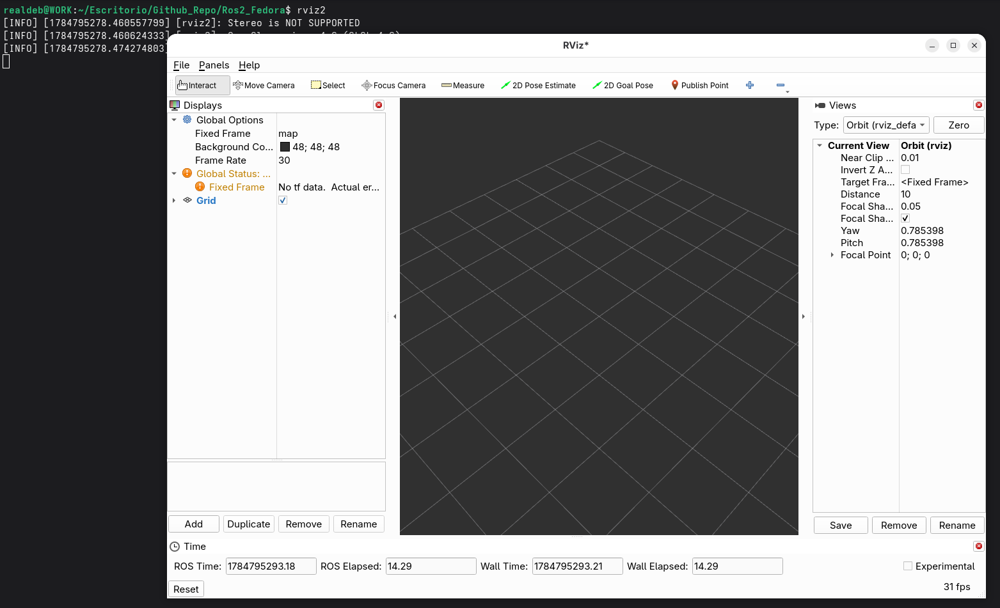
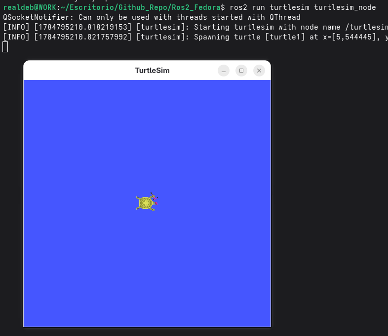

# ROS 2 Jazzy Jalisco nativo para Fedora 44

**Compilado y mantenido por:** [Walther Curo De La Cruz]

Este repositorio proporciona binarios precompilados estables y la guía definitiva de compilación desde cero para **ROS 2 Jazzy** en **Fedora 44**. 

Al ser Fedora un sistema operativo de Nivel 3 (Tier 3) para Open Robotics, no existen binarios oficiales. Este proyecto de ingeniería inversa y compilación resuelve las incompatibilidades generacionales con DNF5, el compilador moderno (CMake >= 3.30), el aislamiento de Python (PEP 668) y las políticas de seguridad estrictas de las macros RPM de Red Hat. El resultado es un *workspace* 100% funcional que incluye las interfaces gráficas completas como **RViz2** y **rqt**.

---

## 💻 Compatibilidad de Hardware

Los binarios distribuidos en este repositorio fueron compilados bajo la arquitectura estándar `x86_64` con optimización genérica (`-mtune=generic`). 

* **Soportado:** Cualquier procesador de 64 bits de **Intel** (Core, Xeon, Pentium) o **AMD** (Ryzen, EPYC, Athlon) ejecutando Fedora 44.
* **No soportado:** Arquitecturas ARM (`aarch64`), como Raspberry Pi o procesadores Apple Silicon. Para utilizar ROS 2 en estas plataformas, deberás seguir la Guía de Desarrolladores y compilar desde el código fuente.

---

## 🚀 Instalación Rápida (Recomendado)

Para los usuarios de Fedora 44, hemos empaquetado ROS 2 Jazzy en un archivo RPM nativo. Olvídate de compilar durante horas.

**1. Descargar e Instalar:**
Descarga el archivo `ros2-jazzy-1.0-1.fc44.x86_64.rpm` desde la sección **Releases** de este repositorio y ejecútalo con `dnf`. El gestor de paquetes se encargará de instalar automáticamente las dependencias necesarias.

    sudo dnf install ./ros2-jazzy-1.0-1.fc44.x86_64.rpm

*(Alternativa: Si prefieres no instalarlo a nivel de sistema, puedes descargar el archivo `.tar.gz` de los Releases, extraerlo en una carpeta local e instalar las dependencias manualmente).*

**2. Activar ROS 2:**
El framework se instala en el directorio estándar de la industria. Para usarlo en tu terminal actual, simplemente ejecuta:

    source /opt/ros/jazzy/setup.bash

*(Tip: Puedes agregar el comando anterior al final de tu archivo `~/.bashrc` para que ROS 2 esté disponible automáticamente en cada terminal nueva).*

**3. Prueba de Fuego:**
Verifica que el entorno 3D y las herramientas gráficas basadas en Qt funcionan correctamente:

    rviz2
    

También puedes verificar que la simulación 2D clásica responde sin problemas:

    ros2 run turtlesim turtlesim_node

---

## 🛠️ Guía para Desarrolladores: Compilar y Empaquetar desde cero

Si deseas auditar el código, aplicar modificaciones o replicar mi proceso de construcción en Fedora 44, aquí tienes la bitácora completa sorteando los obstáculos exclusivos de esta distribución. 

> **Nota:** Copia y pega los comandos de los recuadros grises tal cual. Las explicaciones están fuera del código para evitar errores de sintaxis en tu terminal.

### Fase 1: Preparación del Entorno (DNF5 y PEP 668)
Fedora restringe la instalación global de paquetes de Python (PEP 668). Usaremos un entorno virtual (`venv`) híbrido para aislar herramientas de ROS, pero permitiendo el acceso a las librerías del sistema operativo (vital para compilar Qt5).

**Actualizar el sistema e instalar herramientas base:**

    sudo dnf upgrade --refresh -y
    sudo dnf install @c-development @development-tools -y
    sudo dnf install cmake gcc-c++ make git wget tar bzip2 patch python3-pip python3-devel -y

**Crear el entorno virtual para las herramientas de construcción:**

    mkdir -p ~/Aplicaciones/ROS2 && cd ~/Aplicaciones/ROS2
    python3 -m venv ros2_venv

**Abrir el entorno al sistema (Crucial para PyQt5) y activarlo:**

    sed -i 's/include-system-site-packages = false/include-system-site-packages = true/g' ros2_venv/pyvenv.cfg
    source ros2_venv/bin/activate

**Instalar herramientas del ecosistema ROS por pip e inicializar rosdep:**

    pip install -U pip setuptools
    pip install colcon-common-extensions vcstool rosdep flake8-docstrings
    sudo $(which rosdep) init
    rosdep update

### Fase 2: Descarga del Código Fuente
Descargamos la versión LTS (Jazzy) utilizando el manifiesto oficial de Open Robotics:

    mkdir -p src
    wget https://raw.githubusercontent.com/ros2/ros2/jazzy/ros2.repos
    vcs import src < ros2.repos

### Fase 3: Resolución de Dependencias Nativas
Instalaremos manualmente los puentes de Qt5 que confunden al diccionario de ROS en Red Hat, y excluiremos paquetes problemáticos (como implementaciones comerciales de DDS).

**Proveer cabeceras y bindings de Qt directamente desde los repositorios de Fedora:**

    sudo dnf install urdfdom-headers-devel python3-qt5 python3-qt5-devel sip qt5-qtbase-devel -y

**Ejecutar rosdep ignorando excepciones:**

    rosdep install --from-paths src --ignore-src --rosdistro jazzy -y --skip-keys "rti-connext-dds-6.0.1 urdfdom_headers python3-flake8-docstrings"

### Fase 4: Parches de Compatibilidad CMake
El compilador moderno de Fedora 44 rechaza directivas de CMake antiguas (`< 3.5`). Debemos inyectar políticas de retrocompatibilidad usando límites de palabra (`\b`).

**Parchear Ogre3D (Dependencia crítica de RViz2):**

    sed -i 's/\bCMAKE_ARGS\b/CMAKE_ARGS "-DCMAKE_POLICY_VERSION_MINIMUM=3.5"/g' src/ros2/rviz/rviz_ogre_vendor/CMakeLists.txt

**Parchear Orocos_KDL (Búsqueda dinámica por rutas variables):**

    find src -type f -path "*/orocos_kdl_vendor/CMakeLists.txt" -exec sed -i 's/\bCMAKE_ARGS\b/CMAKE_ARGS "-DCMAKE_POLICY_VERSION_MINIMUM=3.5"/g' {} +

### Fase 5: Inyección del Entorno RPM (El truco de PyQt5)
Para que los conectores de C++ a Python (`qt_gui_cpp`) compilen exitosamente fuera de un script oficial `rpmbuild`, debemos emular las variables de empaquetado del sistema operativo:

    export RPM_ARCH=$(uname -m)
    export RPM_PACKAGE_NAME="ros2-jazzy"
    export RPM_PACKAGE_VERSION="1.0"
    export RPM_PACKAGE_RELEASE="1"
    export RPM_OPT_FLAGS="-O2"

### Fase 6: Compilación Optimizada
Lanzamos la compilación. Usamos `--merge-install` para crear una carpeta única (`install/`) fácil de distribuir, y aplicamos la política de CMake globalmente. *(Nota: Este proceso toma más de una hora dependiendo de tu hardware).*

    colcon build --merge-install --cmake-args -DCMAKE_BUILD_TYPE=Release -DCMAKE_POLICY_VERSION_MINIMUM=3.5

Una vez finalizado, puedes crear el empaquetado portátil simple:

    tar -czvf ros2-jazzy-fedora44-x86_64.tar.gz install/

### Fase 7: Creación del Paquete RPM (Avanzado)
Para integrar la compilación con el gestor de paquetes del sistema, debemos envolver la carpeta `install/` en un archivo `.rpm` sorteando las rigurosas inspecciones de seguridad (QA) de Fedora.

**Instalar herramientas RPM e inicializar el árbol:**

    sudo dnf install rpm-build rpmdevtools -y
    rpmdev-setuptree
    cp ros2-jazzy-fedora44-x86_64.tar.gz ~/rpmbuild/SOURCES/

**Crear la receta del paquete:**
Abre tu editor de texto favorito y crea el archivo `~/rpmbuild/SPECS/ros2-jazzy.spec`. Presta especial atención a las macros de la cabecera para evadir las verificaciones estrictas:

    %define debug_package %{nil}
    %define __brp_check_rpaths %{nil}
    %define __brp_mangle_shebangs %{nil}

    Name:           ros2-jazzy
    Version:        1.0
    Release:        1%{?dist}
    Summary:        ROS 2 Jazzy Jalisco precompilado para Fedora 44

    License:        Apache-2.0
    URL:            https://docs.ros.org/en/jazzy/
    Source0:        ros2-jazzy-fedora44-x86_64.tar.gz

    AutoReqProv:    no
    Requires:       python3-qt5 python3-qt5-devel sip qt5-qtbase-devel urdfdom-headers-devel

    %description
    Binarios precompilados de ROS 2 Jazzy Jalisco. Se instala en /opt/ros/jazzy.

    %prep
    %setup -q -c -n ros2-jazzy

    %install
    mkdir -p %{buildroot}/opt/ros/jazzy
    cp -r install/* %{buildroot}/opt/ros/jazzy/

    %files
    /opt/ros/jazzy/

    %changelog
    * Thu Jul 23 2026 [Tu Nombre] <tu_correo@ejemplo.com> - 1.0-1
    - Empaquetado nativo para Fedora 44 superando QA check-rpaths y mangle-shebangs

**Construir el RPM evadiendo explícitamente el validador de rutas relativas locales:**

    QA_RPATHS=$((0x0002)) rpmbuild -bb ~/rpmbuild/SPECS/ros2-jazzy.spec

El archivo final se ubicará en `~/rpmbuild/RPMS/x86_64/`.

---
*Mantenido por [Walther Curo De La Cruz] - Contribuciones y reportes de errores son bienvenidos en la sección de Issues.*
